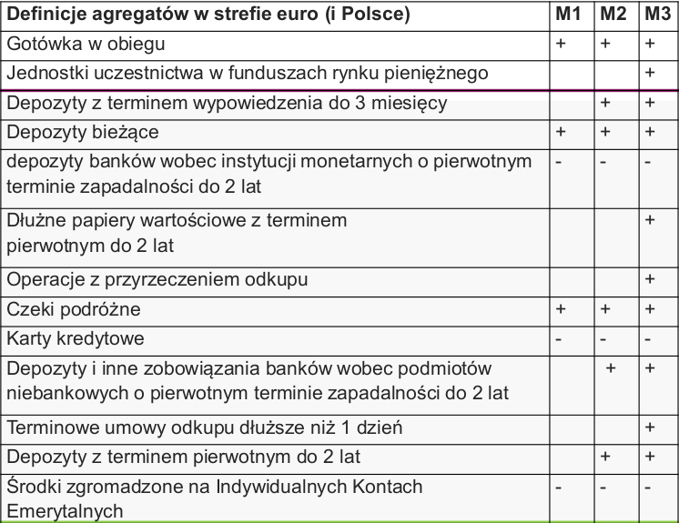
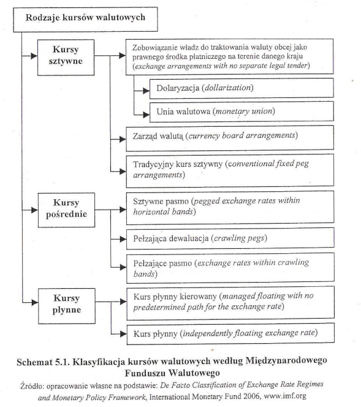
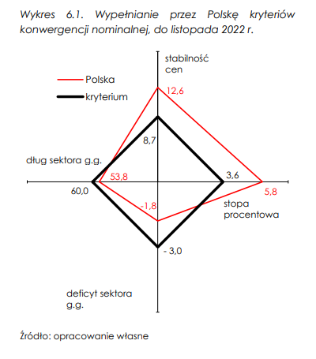

---  
tags:  
- PP  
date created: Thursday, January 26th 2023, 1:33:35 pm  
date modified: Thursday, January 26th 2023, 11:36:19 pm  
share: TRUE  
title: Egzamin PP  
---  
- [Polityka pieniężna - I wykład](./Polityka%20pieni%C4%99%C5%BCna%20-%20I%20wyk%C5%82ad.md)  
  
  
## Cele NBP  
  
### Cele Operacyjne  
- NBP - kształtowanie stawki POLONIA w pobliżu stopy referencyjnej NBP  
	- POLONIA  
	- stopa referencyjna  
  
### POLONIA  
- stopa może **odchylać** się od poziomu stopy referencyjnej NBP w ramach **korytarza** między stopą **lombardową** a **depozytową**  
  
- stopa kształtowana jest przez  
	- inne stopy procentowe  
	- OOR  
	- system rezerwy obowiązkowej  
	- swapy walutowe  
	- interwencje walutowe  
  
  
### Cele Pośrednie  
-  
  
---  
  
## Stopy Procentowe  
  
  
  
  
  
  
### Wartości  
  
  
---  
  
## Pytania  
  
  
## Bank Centralny  
- “Rozdział 2. Bank centralny, jego cechy, funkcje i zadania” ([Rutkowski, p. 5](zotero://select/library/items/EM2GHCHR)) ([pdf](zotero://open-pdf/library/items/VGU6Q22F?page=5&annotation=9LB9ZJ5H))  
  
>polityka monetarna i fiskalna muszą być skoordynowane  
  
  
### Funkcje  
• bank banków  
• bank państwa  
• kredytodawca ostatniej instancji  
• kierowanie polityką pieniężną  
• emisja pieniądza gotówkowego  
• utrzymanie centralnych rezerw walutowych kraju oraz regulowanie kursu waluty krajowej na rynku walutowym  
• nadzór nad bankami komercyjnymi  
  
### Prawo O NBP  
- ustawa o narodowym banku polskim  
	- najważniejsza ustawa  
	- ustawa ==nie określa== funkcji banku centralnego  
	- art. 3 ust. 1  
		- wspieranie polityki gospodarczej rządu  
- zadania NBP  
	- regulowanie płynności banków oraz ich refinansowanie  
		- za pomocą [Operacje Otwartego Rynku](Egzamin%20PP.md#Operacje%20Otwartego%20Rynku)  
	- stabilność systemu finansowego  
	- odpieranie ryzyk systemowych  
  
- konstytucja  
	- art. 227 ust. 1  
		- NBP odpowiada za wartość polskiego pieniądza  
### Organy NBP  
- prezes nbp  
#### Rpp  
- 9 członków - po 3 sejm, senat, prezydent  
	- obecnie 7 członków  
- kadencja - 6 lat  
- obecnie 5 kadencja  
##### Zadania  
- ustala stopy  
- ustala poziom rezerwy obowiązkowej  
	- obniżona z 3.5% do 0.5% - finansowanie obligacji rządowych przez banki  
  
- posiedzenia  
	- co miesiąc  
- założenia polityki pieniężnej  
	- publikowane we wrześniu roku poprzedniego  
- strategia inflacyjna w warunkach płynnego kursu walutowego  
	- nie wyklucza interwencji na rynku walutowym  
  
- Ważnym elementem wykorzystywanej przez Radę strategii celu inflacyjnego jest **komunikacja z otoczeniem**. Z tego względu decyzje Rady wraz z ich uwarunkowaniami są przedstawiane w:  
	- w Informacjach po posiedzeniach Rady na konferencjach prasowych,  
	- w Opisach dyskusji na posiedzeniach decyzyjnych Rady,  
	- Raportach o inflacji,  
	- Założeniach polityki pieniężnej  
	- Sprawozdaniu z wykonania założeń polityki pieniężnej.  
  
  
### Cele  
- cel nadrzędny banków centralnych  
	- niska i stabilna inflacja  
  
  
- cel finalny NBP  
	- współdziałanie z rządem w realizacji programu gospodarczego,  
  
  
- cel strategiczny  
	- średniookresowy cel inflacyjny  
		- 2.5% +/- 1  
	- od 2004 przeciętny poziom inflacji w Polsce wynosił 2.7% rocznie  
  
- cele pośrednie  
	- podażowe  
	- stopy procentowe  
  
- cele operacyjne  
	- W 2023 r. celem operacyjnym polityki pieniężnej NBP będzie **kształtowanie stawki POLONIA w pobliżu stopy referencyjnej** NBP.  
  
#### Płynność Sektora Bankowego  
- zdolność do terminowego regulowania zobowiązań,  
- **Nadmierna płynność** sektora bankowego to nadwyżka podaży rezerw płynnych banków ponad poziom rezerwy obowiązkowej wymaganej przez NBP  
  
  
### Funkcje Banku Centralnego  
- kierowanie polityką pieniężną  
- rezerwy walutowe  
- emisja pieniądza gotówkowego  
  
  
### Działania  
- ekspansywna pp NBP  
- operacje zasilające sektor bankowy w płynność poprzez transakcje repo oraz operacje zakupu obligacji skarbowych na rynku wtórnym w ramach strukturalnych operacji otwartego rynku  
- znacząco spadła rentowność emitowanych obligacji, a w związku z tym obniżył się koszt obsługi zadłużenia publicznego, powiększając tym samym przestrzeń dla niezbędnej stymulacji fiskalnej  
  
#### Rodzaje  
- akomodacyjna polityka pieniężna - wspierająca aktywność gospodarczą  
  
### Sprawozdania  
- Dokumenty RPP. Sprawozdania z wykonania założeń polityki pieniężnej  
	- <https://www.nbp.pl/home.aspx?f=/polityka_pieniezna/dokumenty/sprawozdanie_z_wykonania.html>  
  
  
## Cele Polityki Pieniężnej  
- strategiczne  
	- długookresowe - BCI  
- pośrednie  
	- kształtownie podaży i stóp  
- operacyjne  
	- POLONIA  
		- stop. ref.  
  
## Płynność Sektora Bankowego  
- czynniki  
- rodzaje  
	- jak mierzą  
- ryzyko płynności bankowej  
- rola banku centralnego w ogarnianiu płynności  
  
## Pieniądz  
- funkcje  
  
### Podaż Pieniądza  
- Podaż pieniądza: ilość pieniądza w obiegu (M)  
  
#### Kreacja Pieniądza  
- pierwotna  
	- wprowadzanie gotówki przez bank centralny do systemu  
	- kredyty udzielane bankom komercyjnym przez bank centralny  
- wtórna  
	- **udzielanie kredytów przez banki komercyjne** swoim klientom  
  
#### Wpływanie Na Podaż  
  
##### W Celu Zwiększenia Podaży  
- obniżenie stopy BC w celu zwiększenia pożyczek dla banków komercyjnych  
- zakup rządowych papierów wartościowych na otwartym rynku,  
- obniżenie poziomu stopy rezerwy obowiązkowej;  
  
##### W Celu Zmniejszenia Podaży  
- podwyższenie stopy BC w celu zmniejszenia pożyczek dla banków komercyjnych,  
- sprzedaż posiadanych rządowych papierów wartościowych,  
- podwyższenie poziomu stopy rezerwy obowiązkowej  
  
  
#### Agregaty Pieniężne  
- mnożnik kreacji  
  
- tabela, wykres  
  
  
- baza monetarna **M0** = R+C  
	- R – pieniądz bezgotówkowy banków komercyjnych na rachunkach w banku centralnym  
	- C – pieniądz gotówkowy (monety i banknoty w obiegu poza sektorem bankowym)  
  
- **M1**  
	1. Gotówka w obiegu (bez kas banków)  
	2. Depozyty bieżące (łącznie z overnight)  
		- gospodarstw domowych  
		- niemonetarnych instytucji finansowych  
		- przedsiębiorstw  
		- instytucji niekomercyjnych działających na rzecz gospodarstw domowych  
		- instytucji samorządowych  
		- funduszy ubezpieczeń społecznych  
  
- **M2**  
	- M1+  
	3. depozyty terminowe z terminem pierwotnym do 2 lat włącznie  
	4. depozyty z terminem wypowiedzenia do 3 miesięcy włącznie  
  
- **M3**  
	- M2+  
	5. Operacje z przyrzeczeniem odkupu  
	6. dłużne papiery wartościowe z terminem pierwotnym do 2 lat włącznie  
	7. Jednostki uczestnictwa w funduszach rynku pieniężnego  
  
## Instrumenty Rynku Pieniężnego  
  
### Bon Skarbowy  
- Instrument o podstawie dyskontowej  
- Emitent – Skarb Państwa  
- Termin wykupu od 1 dnia do 52 tygodni  
- Wartość nominalna – 10 tys. zł  
- Stopy zwrotu obliczane na podstawie roku 365-dniowego  
- Podstawa prawna: Ustawa budżetowa, Ustawa o finansach publicznych, Rozporządzenia MF  
  
### Bon Pieniężny NBP  
- Emitent – Narodowy Bank Polski  
- Cel – prowadzenie polityki pieniężnej poprzez operacje na rynku pieniężnym (operacje otwartego rynku)  
- Sprzedaż bonów przez NBP – zmniejszanie ilości pieniądza na rynku  
- Zakup bonów przez NBP - zwiększanie ilości pieniądza na rynku •Wartość nominalna – 10 tys. zł  
- Termin – podstawowe bony 7 dni  
- Uczestnicy rynku – instytucje finansowe i NBP  
- Brak ryzyka  
- Duża płynność  
  
## Instrumenty Polityki Pieniężnej  
  
### Stopy Procentowe  
  
- stopa lombardowa  
	- określa **górny poziom** wzrostu stóp procentowych na rynku **overnight**  
	- wyznacza jednocześnie koszt pieniądza oferowanego przez NBP  
	- Kredyt lombardowy a na celu dostarczenie płynności bankowi komercyjnemu  
  
- stopa referencyjna  
	- określa minimalną rentowność podstawowych (siedmiodniowych) operacji otwartego rynku  
	- wpływa jednocześnie na poziom oprocentowania depozytów na rynku międzybankowym o porównywalnym do operacji otwartego rynku terminach zapadalności  
  
- stopa depozytowa  
	- określa **dolny pułap** rynkowych stóp **overnight**  
	- wyznacza **przychód depozytu** składanego na koniec dnia **w NBP**  
	- symetryczna ze stopą lombardową wobec stopy referencyjnej na rynku stóp overnight[^1]  
		- W XI. 2021 przywrócono symetrię szerokości korytarza stóp procentowych NBP (+50/-50 pb względem stopy Katedra Bankowości  
  
---  
  
- stopa dyskontowa  
	- określa **cenę**, po jakiej bank centralny udziela **kredytu dyskontowego** bankom komercyjnym (kupuje weksle (własne przedsiębiorstw) od banków komercyjnych).  
  
- stopa redyskontowa  
	- określa **cenę**, po jakiej bank centralny udziela **kredytu redyskontowego** bankom komercyjnym (kupuje weksle (handlowe zdyskontowane) od banków komercyjnych).  
  
  
### Stopa Rezerwy Obowiązkowej  
- funkcje  
	- Funkcje tradycyjne  
		- Zabezpieczenie wkładów deponentów  
		- **Wpływanie na mnożnik kreacji pieniądza**  
		- Przysparzanie dochodów bankowi centralnemu, a pośrednio państwu  
	- Funkcje nowoczesne  
		- Tworzenie popytu na pieniądz banku centralnego (w sytuacji nadpłynności sektora bankowego)  
		- Stabilizacja rynkowych stóp procentowych (w przypadku rezerwy opóźnionej i uśrednionej)  
  
- procedura utrzymania rezerw  
	1. Wyznaczanie podstawy naliczania rezerwy  
		- Podstawą naliczania rezerwy są zazwyczaj przyjęte krótkoterminowe depozyty i wyemitowane dłużne bankowe papiery wartościowe.  
		- średnia arytmetyczna ze stanów środków pieniężnych, na koniec każdego dnia tego miesiąca  
	2. Naliczanie rezerwy  
		- Okresy naliczania i utrzymywania rezerwy wynoszą zazwyczaj miesiąc.  
		- **Sposób naliczania** rezerwy może być uśredniony lub nieuśredniony. W przypadku uśrednienia dopuszcza się wyznaczanie średnich na podstawie wszystkich dni okresu naliczania rezerwy lub tylko wybranych.  
	3. Odprowadzanie rezerwy  
	4. Utrzymywanie rezerwy  
  
#### Zwolnienia Z Rezerwy Obowiązkowej  
  
- 2020  
	- odnotowano 4 przypadki nieutrzymania przez banki rezerwy obowiązkowej na wymaganym poziomie.  
- 2021  
	- nie odnotowano przypadku nieutrzymania przez podmioty rezerwy wymaganego poziomu tego instrumentu.  
  
  
  
### Stopy Na Rynku Międzybankowym  
  
- rynek polski  
	- WIBOR (Warsaw Interbank Offered Rate) - przeciętna stopa oprocentowania kredytów  
		- WIBOR zostanie z początkiem przyszłego roku zastąpiony przez WIRD. WIRD to indeks, który określa średnie oprocentowanie transakcji depozytowych zawieranych przez instytucje finansowe, kredytowe i duże firmy.  
	- WIBID (Warsaw Interbank Bid Rate) przeciętna stopa oprocentowania depozytów  
  
- rynek międzynarodowy  
	- LIBOR (London Interbank Offered Rate) – przeciętna stopa oprocentowania kredytów na rynku międzybankowym w Londynie  
	- EURIBOR (Euro Interbank Offered Rate) – przeciętna stopa oprocentowania kredytów na rynku międzybankowym w europejskiej Unii Gospodarczej i Walutowej  
  
  
### Operacje Depozytowo-kredytowe  
- rodzaje  
	- kredyt redyskontowy, kredyt lombardowy, kredyt w ciągu dnia, …  
  
#### Kredyt Refinansowy  
  
- sufit zmienności rynkowych stóp procentowych  
	- stopy procentowe nie powinny jej przekroczyć  
  
##### Funkcje  
- refinansowanie operacji aktywnych banków komercyjnych  
- pomoc w odzyskiwaniu płynności banku komercyjnego w sytuacjach nagłego jej zachwiania  
- wpływ na rynkową stopę procentową, a także sygnalizowanie zmian w restrykcyjności polityki pieniężnej  
  
- tradycyjne  
	- standardowa regulacja płynności banków komercyjnych  
	- kształtowanie rynkowych stóp procentowych  
- nowoczesne  
	- dostarczanie płynności bankowi komercyjnemu w sytuacji nagłego jej zachwiania (kredytodawca ostatniej instancji)  
	- ograniczanie od góry zmienności rynkowych stóp procentowych (sufit zmienności rynkowych stóp procentowych)  
  
- ograniczenia w dostępie do kredytu refinansowego  
	- w wysokości kredytu  
		- limity  
		- posiadana przez dany bank ilość walorów mogących być zastawem w przypadku kredytu refinansowego  
	- stopa procentowa  
		- znacząco wyższa od rynkowej - Oprocentowanie kredytu refinansowego, niewymienionego w § 2 (Uchwała RPP j.w.), jest **wyższe o 1 punkt procentowy niż oprocentowanie kredytu lombardowego** i wynosi **8,25%**  
  
##### Stopy Refinansowe NBP  
- kredyt redyskontowy: 6,80%  
- kredyt wekslowy (dyskontowy): 6,85%  
- kredyt lombardowy: 7,25%  
  
#### Kredyt W Ciągu Dnia (techniczny)  
- kredyt **nieoprocentowany**, zabezpieczany skarbowymi papierami wartościowymi, zaciągany i spłacany w tym samym dniu operacyjnym.  
- instrument ułatwiający bankom zarządzanie płynnością w ciągu dnia operacyjnego  
- zapewnia jednocześnie płynność rozrachunku międzybankowego NBP  
  
  
  
- kredyt lombardowy  
- kredyt redyskontowy  
		-  
  
-  
  
- stopy  
	-  
  
### Operacje Otwartego Rynku  
#### Cele  
- Kształtowanie płynności sektora bankowego i przez to jego zdolności do kreacji pieniądza  
- Pośrednie lub bezpośrednie wpływanie na poziom stóp procentowych,  
- Zwiększanie efektywności działania rynku pieniężnego.  
  
#### Podział  
  
##### Wpływ Na Płynność Sektora Bankowego  
  
###### Operacje Zasilające  
- Transakcje, w których **BC kupuje** papiery wartościowe -> BC daje sianko na rynek -> powodują **zwiększenie płynności** sektora bankowego  
- Mechanizm  
	- BC chce obniżyć wysokość stóp % na rynku -> daje tańszy kredyt o niższym oprocentowaniu (kredyt ten jest w formie skupu papierów wartościowych posiadanych przez banki, ale wychodzi na to samo, tylko wyższy poziom komplikacji)  
  
###### Operacje Absorbujące  
- Transakcje, w których BC sprzedaje lub emituje własne papiery wartościowe -> BC zabiera sianko w zamian za papierek -> powoduje to **zmniejszenie płynności** sektora bankowego  
- Mechanizm  
	- BC chce podnieść wysokość stóp % na rynku -> Sprzedaje papiery wartościowe taniej niż na rynku -> wyższa stopa % dla banku -> **Wielkość płynnych środków** w obiegu **zmniejsza się** (zmniejsza się przez to możliwość kreacji pieniądza wkładowego przez banki) -> Rynkowe **stopy procentowe** lokat (i w konsekwencji kredytów) **ulegają podwyższeniu** z uwagi na konkurencyjność przeprowadzonych przez BC operacji sprzedaży i mniejszą dostępność pieniądza na rynku (bo bank centralny licytuje więcej niż Kowalski)  
  
##### Warunkowość  
- bezwarunkowe  
	- natychmiastowe transakcje kupna / sprzedaży pap. wartościowych przez BC od instytucji kredytowych  
- warunkowe  
	- jednoczesne zawarcie pomiędzy BC a instytucjami kredytowymi transakcji natychmiastowej kupna / sprzedaży pap. wartościowych i przeciwstawnej do niej transakcji terminowej  
  
  
|             |  Kupno                                                                                                                                                                                                                                     |  Sprzedaż                                                                                                                                                                                                                                                                                                                                                                |  
|:---------------|:-------------------------------------------------------------------------------------------------------------------------------------------------------------------------------------------------------------------------------------------|:-------------------------------------------------------------------------------------------------------------------------------------------------------------------------------------------------------------------------------------------------------------------------------------------------------------------------------------------------------------------------|  
|  Warunkowe     |  Repo
 
-&nbsp;BC kupuje od instytucji kredytowych papiery wartościowe **pod warunkiem** ich odsprzedaży w określonym terminie i po określonej cenie

 

- w pasywach banku (bo zobowiązanie)
 
 |  Reverse Repo
 
- BC sprzedaje instytucji kredytowej papiery wartościowe **pod warunkiem** ich odsprzedaży w określonym terminie i po określonej cenie 

 

- w aktywach banków (bo aktywa finansowe)

 

- Cel: **ograniczenie podaży pieniądza** (zabiera siano, daje nic nie warty papier ;))) )
 
 |  
|  Bezwarunkowe  |  Outright Purchase
 
-&nbsp;BC kupuje od inst. kred. papiery wartościowe
                                                                             
                                                               |  Outright Sale
 
-&nbsp;BC sprzedaje inst. kred. papiery wartościowe lub emituje własne walory
                                                             
                                                                                                                                                                                       |    
  
  
  
#### Operacje Podstawowe (RRCO)  
- Regularność  
	- standardowo przeprowadzane w sposób regularny raz w tygodniu, z reguły z 7-dniowym terminem zapadalności.  
- Rentowność  
	- na przetargach obowiązuje stała rentowność na poziomie stopy referencyjnej NBP.  
- Charakter operacji:  
	- Z uwagi na oczekiwane utrzymywanie się nadpłynności w sektorze bankowym operacje te polegają na emisji bonów pieniężnych NBP.  
#### Operacje Dostrajające  
- Operacje dostrajające mogą zostać podjęte w celu ograniczenia zmienności krótkoterminowych rynkowych stóp procentowych.  
- operacje absorbujące:  
	- emisja bonów pieniężnych NBP,  
	- transakcje reverse repo;  
- operacje zasilające:  
	- przedterminowy wykup bonów pieniężnych NBP,  
	- transakcje repo.  
#### Stawka POLONIA  
- Polish Overnight Index Average  
- wprowadzona w 2005  
- średnia stawka overnight ważona wielkością transakcji na rynku depozytów międzybankowych,  
- poziom stawki odzwierciedla rzeczywiste oprocentowanie krótkoterminowych lokat międzybankowych.  
  
#### Operacje Strukturalne  
- po co  
	- przeprowadzone w celu długoterminowej zmiany struktury płynności w sektorze bankowym  
- jak  
	- emisja obligacji  
	- zakup oraz sprzedaż papierów wartościowych na rynku wtórnym  
- kiedy  
	- 13 i 27 maja 2020: NBP przeprowadził operacje strukturalne, w postaci transakcji typu outright buy (purchase)  
	- W reakcji na wybuch pandemii NBP uruchomił strukturalne operacje otwartego rynku polegające na skupie na rynku wtórnym dłużnych papierów wartościowych (od 19 marca 2020 r.). W ramach tych operacji początkowo NBP skupował obligacje skarbowe  
	- W 2021 r. operacje strukturalne przeprowadzane były w okresie styczeń – listopad. Dokonywano ich w trybie regularnym, zgodnie z terminami ogłaszanymi przez NBP z wyprzedzeniem. W październiku i listopadzie ograniczono skalę, a w grudniu zakończono operacje strukturalne skupu obligacji na rynku wtórnym.  
  
  
- absorbujące  
	-  
- zasilające  
  
- mechanizm oddzialywania  
	- ze wzgledu na rodzaj w klasyfikacji  
  
  
  
### Stopy Procentowe  
- rodzaje  
- wartość stóp  
	- wykres  
- rynek międzybankowy  
  
### Kursy I Operacje Walutowe  
- podział  
	- rodzaje kursów walutowych  
		-   
  
  
  
- deprecjacja, rewaluacja  
-  
- ryzyko walutowe  
	-  
  
- polityka kursowa  
	- administracyjna  
	- rynkowa  
	- Wiśniewski, M., & Skopowski, M. (2012). _Instrumenty współczesnej polityki pieniężnej—Wydanie I_. s. 111  
  
### Polityka Pieniężna EBC  
- [ ] #todo  
  
#### Porównanie OOR W NBP I EBC  
-  
  
  
  
### Inflacja  
- [ ] #todo  
  
### Polska W UE, Kryteria Konwergencji  
- ostatnia prezentacja?  
  
  
- [ ] Ze względu na fakt, że złoty nie uczestniczy w ERM II, Polska nie wypełnia kryterium kursu walutowego  
- [ ]  
  
  
#### Polska W Euro  
##### Korzyści  
- bezpośrednie  
	- a) Redukcja ryzyka kursowego i kosztów transakcyjnych  
	- b) Wzrost stabilności i wiarygodności makroekonomicznej  
	- c) Spadek stóp procentowych  
1. Intensyfikacja wymiany handlowej  
2. Wzrost inwestycji  
3. Integracja, rozwój i stabilność rynków finansowych  
4. Wzrost PKB i dobrobytu  
  
##### Zagrożenia  
1. Długookresowe  
	1. Koszt utraty niezależnej polityki pieniężnej  
	2. Koszt utraty nominalnego kursu walutowego jako mechanizmu dostosowawczego  
  
###### Średniookresowe  
1. Zagrożenia związane z przyjęciem **nieoptymalnego kursu konwersji**  
	- Wejście Polski do strefy euro będzie wymagało ustalenia kursu konwersji, po którym waluta krajowa zostanie zastąpiona przez euro.  
  
- ==Niedowartościowany== kurs konwersji -> zbyt słaby PLN  
	- przegrzanie gospodarki -> presja inflacyjna, bo:  
		- relatywnie wysokie ceny importu  
			- drogi import wpłynąłby negatywnie na innowacyjność polskiej gospodarki  
		- presja popytowa, bo tanie produkty lokalne  
  
- ==Przewartościowany== kurs konwersji (PLN zbyt mocny)  
	- obniżenie konkurencyjności gospodarki  
		- spadek eksportu (bo droższy) i wzrost importu (bo dobra z zagranicy tańsze)  
	- pozytywny, chociaż krótkookresowy wpływ na poziom wyrażonych w euro płac, rent, emerytur, świadczeń socjalnych itp.  
  
1. Ryzyko pogorszenia konkurencyjności polskiej gospodarki  
  
  
  
2. **Krótkookresowe**  
   1. Zagrożenia związane z wypełnianiem kryteriów konwergencji  
   2. Krótkookresowe efekty cenowe wprowadzenia euro do obiegu gotówkowego  
      - w ramach niektórych grup produktów miał miejsce relatywnie duży wzrost cen. Problem ten dotyczył **głównie kategorii dóbr i usług najczęściej nabywanych**, w tym przede wszystkim żywności, odzieży oraz usług takich, jak fryzjerstwo.  
   3. Koszty wprowadzenia euro do obiegu bezgotówkowego i gotówkowego  
  
  
  
  
  
  
  
#### Kryteria Konwergencji  
>Kraj, który zamierza przyjąć euro jako swoją walutę, musi spełnić tzw. kryteria konwergencji  
  
- Kryteria konwergencji nominalnej  
  
1. Kryterium **stabilności cen** – inflacja nie wyższa niż 1,5 punktu procentowego ponad średni poziom inflacji w trzech krajach o najbardziej stabilnych cenach  
2. Kryterium fiskalne – deficyt budżetowy nie większy niż 3% PKB oraz dług publiczny nieprzekraczający 60% PKB  
3. Kryterium stóp procentowych - długoterminowa stopa procentowa nie wyższa niż 2 punkty procentowe ponad średni poziom stóp procentowych w trzech krajach UE o najbardziej stabilnych cenach  
4. Kryterium kursowe – stabilny kurs walutowy niewykraczający poza poziom wahań (+/- 15%) wobec ustalonego kursu do euro w systemie ERM II przez dwa lata  
  
  
#### Mechanizm Kursów Walutowych  
- ERM - Mechanizm Kursów Walutowych (European Exchange Rate Mechanism – ERM) został wprowadzony przez Wspólnotę Europejską w marcu 1979 r.  
  
- ERM II  
	- 1999 (euro)  
	- Przygotowania do wejścia do mechanizmu ERM II powinny rozpocząć się na około 6 miesięcy przed planowaną datą  
	- W momencie przystępowania do mechanizmu ERM II **nie jest wymagane spełnianie wszystkich kryteriów konwergencji**, jednak bieżący stopień ich spełnienia oraz perspektywy mogą w znaczący sposób przekładać się na kształtowanie się kursu walutowego i zdolność do spełnienia kryterium kursowego.  
  
  
#### Konwergencja Realna  
- **analiza** podobieństwa cykli koniunkturalnych państw, a w przypadku Polski: Polski i strefy euro.  
- **analiza** gospodarki pod względem  
	- wzrostu gospodarczego i PKB per capita,  
	- poziomu oszczędności i inwestycji,  
	- stopnia wydajności pracy i nakładów na B+R,  
	- mobilności kapitału i siły roboczej, rynku pracy i bezrobocia,  
	- stopnia otwartości gospodarki  dywersyfikacji produkcji  
  
  
  
  
  
  
### Kurs Konwersji  
- Kurs konwersji  
	- Niedowartościowany kurs konwersji (PLN zbyt słaby)  
		- może skutkować **przegrzaniem gospodarki** i w efekcie nadmierną **presją inflacyjną**, wynikającą zarówno z **wysokich cen importu**, jak i z **presji popytowej**.  
			-  
		- **drogi import** wpłynąłby negatywnie na innowacyjność polskiej gospodarki, będącej importerem nowych technologii, w dłuższym horyzoncie czasowym obniżając potencjał rozwojowy gospodarki.  
  
- Przewartościowany kurs konwersji (PLN zbyt mocny)  
	- obniżenie konkurencyjności gospodarki i w konsekwencji doprowadzenie do spadku eksportu i wzrostu importu (wzrostu deficytu na rachunku obrotów bieżących),  
	- niska zyskowność działalności gospodarczej negatywnie oddziaływałaby na aktywność gospodarczą, zniechęcając do inwestycji w sektorze handlowym oraz przyczyniając się do spadku zatrudnienia i tempa wzrostu gospodarczego.  
	- pozytywny, chociaż krótkookresowy wpływ na poziom wyrażonych w euro płac, rent, emerytur, świadczeń socjalnych itp.  
  
### Zagregowane Ryzyko Płynności W Sektorze Bankowym  
  
  
### Sterylizowana  
  
### Pomiar in  
- pomiar inflacji - CPI (consumer price index)  
- kursy sztywne vs kursy płynne  
- luzowanie monetarne NBP  
	- rynek wtórny?  
- kryteria konwergencji  
	- realne vs nominalne  
	- Chorwacja - euro  
	- jakie kryteria konwergencji spelnia polska // ile  
  
### Inflacja  
- przyczyny  
- deflacja  
- oczekiwania inflacyjne  
- prognozowanie inflacji  
-  
  
zwiększona emisja pieniądza prowadzona przez:  
1. dodruk banknotów,  
2. oprocentowanie pieniędzy,  
3. działalność kredytową banków komercyjnych (tzw. "bankowa kreacja  
pieniądza").  
  
- rodzaje  
	- cpi  
	- hicp  
	- ppi  
	-  
  
  
### Rodzaje Przetargów W Operacjach Otwartego Rynku  
- Wiśniewski, M., & Skopowski, M. (2012). _Instrumenty współczesnej polityki pieniężnej—Wydanie I_. s. 82  
  
  
### Rodzaje Kredytów  
- kredyt redyskontowy  
  
---  
  
[^1]:Wiśniewski, M., & Skopowski, M. (2012). _Instrumenty współczesnej polityki pieniężnej—Wydanie I_., s. 153