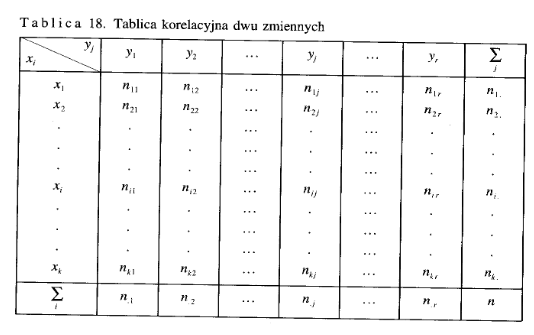
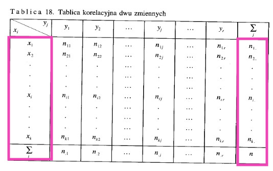
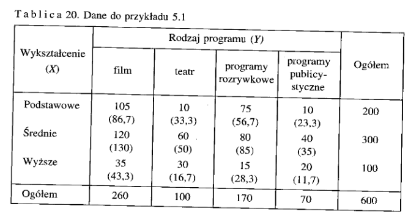
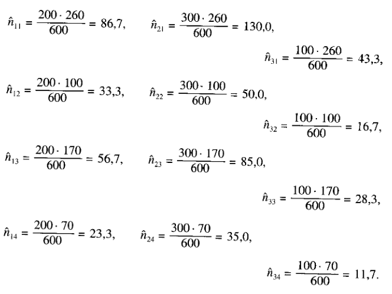
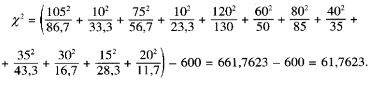

---  
tag: books, books/statistics  
title: Statystyka  
author: M. Sobczyk  
share: true  
---  
  
- Dział statystyki zajmujący się badaniem związków między kilkoma zmiennymi nosi nazwę **teorii współzależności**  
  
- Istota zależności funkcyj- nej polega na tym, że zmiana wartości jednej zmiennej powoduje Ściśle określoną zmianę drugiej zmiennej. Tak więc w zależności funkcyjnej | okreś eślonej wartości jednej zmiennej (X) odpowiada jedna i tylko jedna wartość drugiej zmiennej (Y). Symbolem X oznaczamy zmienną niezaleną (objaśniającą), natomiast symbolem Y — zmienną zależną (objaśnianą).  
	- Zależność stochastyczna występuje wtedy, gdy wraz ze zmianą jednej zmiennej zmienia się rozkład prawdopodobieństwa drugiej zmiennej.  
	- Zwrócić należy uwagę, że badanie związków korelacyjnych ma sens jedynie wtedy, **gdy między zmiennymi istnieje więź przyczynowo-skutkowa**, dająca się logicznie wytłumaczyć.  
- Podstawą do badania korelacji między zmiennymi mogą być szeregi statyczno-przekrojowe lub dynamiczne.  
- Rozkład brzegowy prezentuje strukturę wartości jednej zmiennej (X lub Y) bez względu na kształtowanie się wartości drugiej zmiennej.  
  
# Rozkład brzegowy  
  
-   
  
- ## Rozkład brzegowy  
	- Rozkład brzegowy prezentuje strukturę wartości jednej zmiennej (X lub Y) bez względu na kształtowanie się wartości drugiej zmiennej. Wynika stąd, że w tablicy korelacyjnej są dwa rozkłady brzegowe.  
	- **Rozkład brzegowy zmiennej X** tworzy pierwsza i ostatnia kolumna tablicy 18 -   
	- natomiast **rozkład brzegowy zmiennej Y** — pierwszy i ostatni wiersz. - .jpg)  
- Średnie arytmetyczne z rozkładów brzegowych oblicza się następująco  
	- $\bar{x} = 1/n * \sum^k_{i=1} *x_i * n_i$  
	- $\bar{y} = 1/n * \sum^r_{j=1} *x_j * n_j$  
- Rózkłady brzegowe i warunkowe mogą być scharakteryzowane pewnymi sumarycznymi wielkościami. W analizie korelacji szczególnie użytecznymi miarami są: Średnia arytmetyczna i wariancja (lub odchylenie standardowe).   
  
- ## Rozkład warunkowy  
	- Rozkład warunkowy prezentuje strukturę wartości jednej zmiennej (X lub Y), pod warunkiem, że druga zmienna przyjęła określoną wartość.Rozkład warunkowy zmiennej X zapisujemy następująco: X |Y=y, natomiast rozkład warunkowy zmiennej Y zapisujemy: Y|X = x,. Rozkładów warunkowych zmiennej X jest więc w tablicy **tyle, wariantów zmiennej** Y, i na odwrót.  
	- Wzory na średnie arytmetyczne rozkładów warunkowych — przy oznaczeniach stosowanych w tablicy 18 — przyjmują postać:  
		- $\bar{x} = 1/n_j \sum^k_{i=1} * x_i * n_{ij}$  
		- $\bar{y} = 1/n_i \sum^r_{j=1} * y_j * n_{ij}$  
  
- Liniowość zwiążku można ocenić na podstawie różnicy między średnimi warunkowymi danej zmiennej, obliczonymi dla konkretnych wariantów drugiej zmiennej. Związek jest liniowy, jeżeli różnice między średnimi są takie same, tzn:  
	- $$\bar{x}_2 - \bar{x}_1 = \bar{x}_3 - \bar{x}_2$$  
	- $$\bar{y}_2 - \bar{y}_1 = \bar{y}_3 - \bar{y}_2$$  
- Badanie współzależności ma sens jedynie wówczas, gdy pomię- dzy zmiennymi występują powiązania typu stochastycznego lub co najmniej korelacyjnego  
	- Badanie niezależności stochastycznej oparte na równości średnich warunkowych i wariancji warunkowych jest możliwe tylko w przypadku cech mierzalnych. W praktyce badań statystycznych spotykamy się również z koniecznością oceny niezależ- ności stochastycznej cech niemierzalnych. W takich przypadkach weryfikację hipotezy o niezależności zmiennych umożliwia test nieza-leżności chi-kwadrat.  
	- Załóżmy, że przedmiotem badania jest populacja generalna scharak- teryzowana za pomocą dwóch cech jakościowych. Z populacji tej wylosowano niezależnie dużą próbę o liczebności n elementów, a wyni- ki tej próby sklasyfikowano w tzw. tablicę niezależności o r wierszach i k kolumnach (por. tablicę 18).  
		- Tablica niezależności jest podstawą weryfikacji nieparametrycznej hipotezy zerowej głoszącej, że n-elementowa próba losowa pochodzi z takiej zbiorowości generalnej, w której występuje stochastyczna niezależność zmiennych losowych X i Y. Zapis formalny tej hipotezy jest następujący:  
			- $H_0: E(n_{ij}) = E(\hat{n}_{ij})$ - cechy X i Y są niezależne  
			- $H_1: E(n_{ij}) \neq E(\hat{n}_{ij})$ - cechy X i Y nie są niezależne  
		- Do weryfikacji H, o niezależności stochastycznej zmiennych wyko- rzystuje się statystykę:  
			- $$\chi^2 = \sum_{i=1}^k\sum_{j=1}^k(\frac{\hat{n}^2_{ij}}{\hat{n}_{ij}}) - n$$  
			- Statystyka ta ma — przy założeniu prawdziwości $H_0$ — dla dużych prób asymptotyczny rozkład $\chi^2$ z (r-1)(k-1) stopniami swobody.  
			- Liczebności teoretyczne ń,, oblicza się według wzoru: $\hat{n}_{ij}$ = (suma liczebności empirycznych i-tego wiersza x suma liczebności empirycznych j-tej kolumny) / liczebność próby  
			- Obszar krytyczny (prawostronny) w rozważanym teście określa nierówność: $\chi^2 > \chi^2_\alpha$.gdzie $\chi^2_\alpha$ jest wartością krytyczną odczytaną z tablicy rozkładu $\chi^2_\alpha$ dla ustalonego z góry poziomu istotności $\alpha$ (0,05 lub 0,01) i dla (k — 1)(r — 1) stopni swobody w taki sposób, aby zachodziła relacja: $P(\chi^2 \geq \chi^2_\alpha) = \alpha$  
		- Przykład  
			-   
			- $\hat{n}{ij}$  
			- liczebności teoretyczne  
				-   
				- $\hat{n}_{1, 1} = \frac{200*260}{600} = 86,7$  
				- ...  
			- $\chi^2=$  
				-   
			- Z tablic rozkładu $\chi^2$ dla poziomu istotności $\alpha = 0,05$ i (4-1)x(3—1) = 6 stopni swobody odczytujemy wartość krytyczną $\chi^2_\alpha$ = 12,592. Z uwagi na to, że $\chi^2$ = 61,7623 > $\chi^2_\alpha$ = 12,592, hipotezę zerową o niezależności zmiennych odrzucamy. Oznacza to, że między rodzajem oglądanego programu telewizyjnego i wykształceniem telewidzów **zachodzi zależność stochastyczna**  
  
# Opisowe miary siły korelacji dwóch zmiennych  
  
- Zakładajc, że współzależność badanych zmiennych losowych X i Y jest statystycznie istotna, możemy wyróżnić cztery rodzaje podstawowych miar siły korelacji tych zmiennych, a mianowicie: 1) współczynnik zbieżnóści'Czuprowa, 2) stosunki (wskaźniki) korelacyjne Pearsona, 3) współczynnik kórelacji liniowej Pearsona, 4) współczynnik korelacji kolejnościowej (rang) Spearmana  
  
## Stosunki (wskaźniki) korelacyjne Pearsona  
  
- Konstrukcja stosunków korelacyjnych opiera się na równości wariancyjnej, której istotą jest — jak pamiętamy (por. punkt 2.2 w rozdziale II) — rozłożenie wariancji ogólnej na dwa składniki: Średnią z wariancji wewnątrzgrupowych i wariancję średnich warunkowych.  
- do obliczenia korelacji liniowych potrzebne jest określenie wartości wariancji międzygrupowych zmiennych Y i X oraz wariancji wewnątrzgrupowych zmiennych Y i X  
	- Wariancje międzygrupowe zmiennych Y i X są obliczane ze wzorów:  
		- $s^2(\bar{y}_i) = 1/n * \sum^k_{i=1} * (\bar{y}_i - \bar{y})^2*n_i$  
		- $s^2(\bar{x}_j) = 1/n * \sum^r_{j=1} * (\bar{x}_j - \bar{y})^2*n_j$  
		- gdzie $\bar{y}_i$, oraz $\bar{x}_j$, są odpowiednio średnimi warunkowymi zminnych Y i X, a $\bar{y}$ i $\bar{x}$ są średnimi ogólnymi obliczonymi z rozkładów brzegowych.  
	- wariancje wewnątrzgrupowe są natomiast wyznaczane z relacji:  
		- $$\overline{s^2_i(y)} = 1/n \sum_{i=1}^k * s^2_i(y) * n_i$$  
		- $$\overline{s^2_j(x)} = 1/n \sum^r_{j=1} * (x) * n_j$$  
	- stosuek korelacyjny zmiennej Y względem zmiennej X jest zatem równy  
		- $$e_{yx} = \frac{s(\bar{y}_i)}{s(y)}$$  
		- $$e_{xy} = \frac{s(\bar{x}_j)}{s(x)}$$  
	- Stosunki korelacyjne są miarami niemianowanymi, przyjmującymi wartości z przedziału: $O \leq e \leq 1$. Są one.. równe zeru, gdy cechy są nieskorelowane, jedności zaś — gdy między badanymi zmiennymi zachodzi zależność funkcyjna  
	- Stosunki korelacyjne są niesymetryczne (tzn. $e_{xy} \neq e_{yx}$  e,,) z wyjątkiem dwóch przypadków:   
		- 1) gdy zmienne X i Y są niezależne stochastycznie ($e_{xy} = e_{yx} = 0$) oraz 2) gdy między zmiennymi X iY zachodzi zwiazek funkcyjny ($e_{xy} = e_{yx} = 1$). Dlatego też przy obliczaniu stosunków ko- relacyjnych ważne jest ustalenie, która z cech jest zależna, a która niezależna  
		- **Wskaźniki korelacyjne nie wskazują kierunku korelacji badanych zmiennych**; zawsze przyjmują wartości nieujemne  
		- 