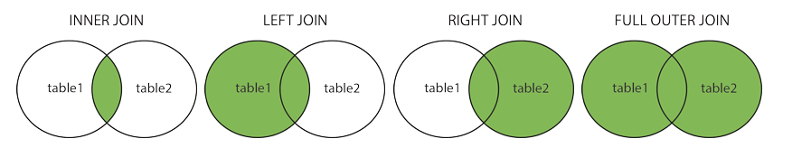
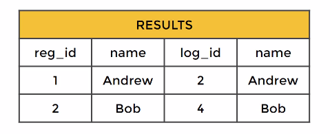
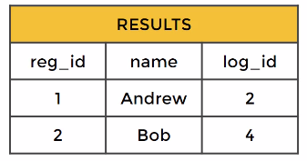
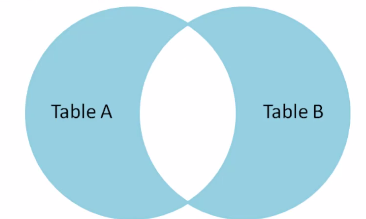
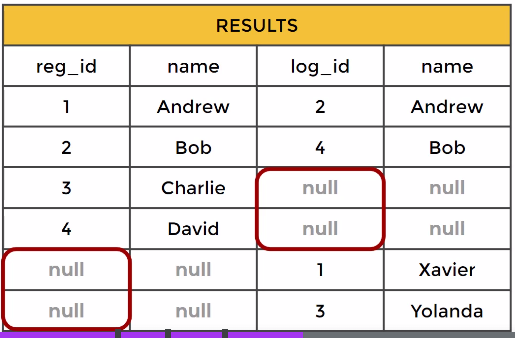
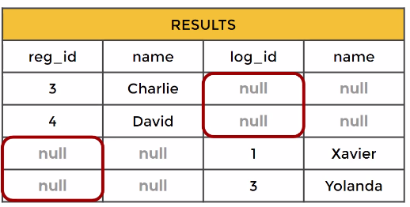
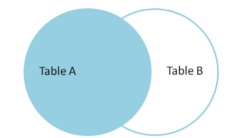
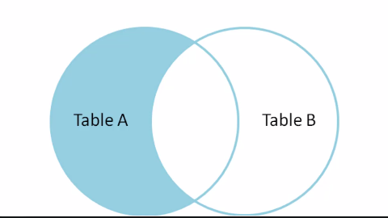
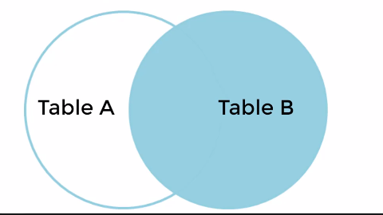

---  
tags:  
- sql  
- data  
- course  
- course/doing  
project:  
- sql  
share: True  
total-runtime: 9 hours  
date created: Wednesday, December 7th 2022, 5:59:25 pm  
date modified: Monday, January 9th 2023, 7:52:42 pm  
link: https://udemy.toolzbuy.com/course/the-complete-sql-bootcamp/learn/lecture/19242668?courseId=762616#overview  
finished: Section 2, Video 16   
title: The Complete SQL Bootcamp 2022 Go From Zero to Hero  
aliases: [The Complete SQL Bootcamp 2022 Go From Zero to Hero]  
linter-yaml-title-alias: The Complete SQL Bootcamp 2022 Go From Zero to Hero  
---  
  
# The Complete SQL Bootcamp 2022 Go From Zero to Hero  
  
## Info  
1. Our QA forums can be found by going to your course dashboard (top right button when viewing a lecture): (<https://support.udemy.com/hc/en-us/articles/229233387-How-to-Use-The-Q-A)>  
2. Our student chat channel is here: <https://discord.gg/TztE6B8>  
3. Video guide to the chat room: <https://www.youtube.com/watch?v=bkH89OJ001M>  
4. Our PDF Notes can be found as resources in the FAQ  lecture. (<https://support.udemy.com/hc/en-us/articles/229604708-Downloading-Supplemental-Resources)>  
5. Info on certification:  <https://support.udemy.com/hc/en-us/articles/229603868-Certificate-of-Completion>  
6. Any video issues or certification issues, email: support@udemy.com  
7. Please do not direct message with questions, due to the amount of students in the course, questions are ONLY answered in the QA Forums (<https://support.udemy.com/hc/en-us/articles/229233387-How-to-Use-The-Q-A).>  
  
## Course  
- for beginners (no prior knowledge needed)  
- using PostgreSQL  
  
## Course Curriculum Overview  
  
1. installation of postgreSQL  
2. databases and tables basics  
3. sql statement fundamentals  
4. group by clause  
5. assesment test 1  
6. joins  
7. advanced sql  
8. commands  
9. assessment test 2  
10. create databases and tables  
11. assessment test 3  
12. extra lectures  
	- postresql with python  
  
  
## Database Overview  
- what are databases?  
	- dbs are systems that allow users to store and organize data  
- why use databases?  
	- useful when dealing with large amounts of data  
  
### From Spreadsheets to Databases  
  
- spreadsheets  
	- one time analysis  
	- quickly need to chart something  
	- reasonable (small) data size  
	- good for newbies  
  
- databases  
	- data integrity  
	- can handle bigger amounts of data  
	- quickly combine different datasets  
	- automate steps for re-use  
	- support for websites and applications  
		- websites and apps are linked to those dbs  
  
- database structure  
	- tables  
	- columns  
	- rows  
  
- database platform options  
	- many  
	- postgresql  
		- free  
		- open source  
		- multi platform  
		- widely used on internet  
	- mysql / mariasql  
		- free  
		- open source  
		- widely used on internet  
		- multiplatform  
	- ms sql server express  
	- microsoft access  
		- cost  
	- sqlite  
		- free  
		- open source  
		- mainly cmd  
  
- postgresql  
	- good to learn sql  
  
- sql is useful for a lot of things!  
  
  
## Install Postgresql  
  
1. install postgresql  
	- linux  
		- `sudo apt install postgresql postgresql-contrib`  
	- Ensure that the service is started:  
		- `sudo systemctl start postgresql.service`  
2. [install pgadmin](https://www.pgadmin.org/download/pgadmin-4-apt/)  
	- `curl -fsS https://www.pgadmin.org/static/packages_pgadmin_org.pub | sudo gpg --dearmor -o /usr/share/keyrings/packages-pgadmin-org.gpg`  
	- `sudo sh -c 'echo "deb [signed-by=/usr/share/keyrings/packages-pgadmin-org.gpg] https://ftp.postgresql.org/pub/pgadmin/pgadmin4/apt/$(lsb_release -cs) pgadmin4 main" > /etc/apt/sources.list.d/pgadmin4.list && apt update'`  
	- `sudo apt install pgadmin4`  
	- `sudo apt install pgadmin4-desktop`  
	- `sudo apt install pgadmin4-web`  
	- Apache successfully restarted. You can now start using pgAdmin 4 in web mode at <http://127.0.0.1/pgadmin4>  
3. download file "dvdrental.tar"  
	- don't open file directly, only via pgadmin  
4. restart computer  
5. restore the database  
  
  
- import database  
	- data/objects  
		- sections  
			- [x] pre-data  
			- [x] data  
			- [x] post-data  
  
  
- queries  
	- right click > query tool  
  
- select all  
	- `SELECT * FROM film`  
  
  
## Sql Statement Fundamentals  
- sql syntax  
- syntax can be applied to major types of sql database  
	- mysql, oracle  
  
### SELECT Statement  
- the most common statement  
- allows to ==retrieve== the information from a table  
  
- syntax  
	- `SELECT column_name FROM table_name`  
	- capitalize syntax statements  
		- easier to read!  
  
- inside a db you will have a few tables  
	- a table consists of rows and columns  
  
- query knows which db you use, since you open a query inside/within it  
  
- one column  
	- `SELECT c1 FROM table_1`  
- multiple columns  
	- separated by comma  
	- `SELECT c1, c3 FROM table_1`  
- all columns  
	- `SELECT * FROM table_1`  
		- ==not a good practice== to use asterisk, if you don't need all the columns  
		- it will automatically query everything, which ==increases traffic== between the database server and the applications  
  
- what tables are available to me?  
	- schemas > public > tables > expand  
  
- view whole table using query  
	- `SELECT * FROM table_name;`  
  
- semicolon at the end of the query  
	- readability  
  
- query history!  
  
### Challenge  
  
- structure  
	- business situation  
	- question  
	- expected answer  
	- hints  
	- solution  
  
- situation  
	- existing customers  
  
- challenge  
	- use `SELECT` to grab the first and last names of the existing customers, also their emails  
  
- answer  
	- `SELECT first_name, last_name, email FROM customer;`  
  
  
## SELECT DISTINCT  
- `SELECT DISTINCT`  
- sometimes there may be duplicate values in a column, thus  
	- return only the unique values in a column  
  
- syntax  
	- `SELECT DISTINCT column FROM table;`  
	- `SELECT DISTINCT(column) FROM table;`  
		- more readability  
  
- when is it useful to use `SELECT DISTINCT`?  
	- ranks  
  
### Challenge  
- situation  
	- mpaa movie ratings (pg, pg-13, R, etc.)  
	- what ratings do we have available  
  
- sql challenge  
	- retrieve unique rating types  
  
- solution  
	- `SELECT DISTINCT(rating) FROM film;`  
	- output  
```  
"PG"  
"R"  
"G"  
"PG-13"  
"NC-17"  
```  
  
  
## COUNT  
- returns the ==number of rows that match== a specific **condition** of a query  
- we can apply `COUNT` on a specific column `COUNT(column)` or just pass `COUNT(*)`  
	- output is usually the same, since all columns have the same number of rows (generally), unless we use a specific condition  
  
- syntax  
	- `SELECT COUNT(column_name) FROM table;`  
  
- combine  
	- with `DISTINCT`  
	- `SELECT COUNT(DISTINCT(column_name)) FROM table;`  
  
  
## SELECT WHERE  
- `SELECT` and `WHERE` most fundamental statements  
- `WHERE` statement allows us to specify conditions on columns for the rows to be returned  
  
### Syntax  
  
```SQL  
SELECT column1, column2  
FROM table  
WHERE conditions;  
```  
  
- `WHERE` specifies conditions  
	- conditions are used to filter the rows returned from the `SELECT` statement  
  
- appears after `FROM` clause  
- not unique to postgreSQL  
  
- compare operators  
	- compare column value to something  
		- is the price greater than $3?  
		- is the pet's name equal to "Sam"?  
  
### Operators  
- operators  
	- math operators  
		- =, >, <, >=, <=, <> or !=  
	- logical operators  
		- `AND`  
			- conjunction  
		- `OR`  
			- alternative  
		- `NOT`  
			- opposite  
  
### Examples  
- name = "David"  
	- `SELECT name, choice FROM table WHERE name = 'David'`  
		- single quotes  
		- capitalization does matter  
  
- multiple WHERE conditions  
```sql  
SELECT * FROM film  
WHERE (rental_rate > 4) AND (replacement_cost >= 19.99);  
```  
  
  
### Challenge  
- email for Nancy Thomas  
```sql  
SELECT email FROM customer  
WHERE (first_name = 'Nancy') AND (last_name = 'Thomas');  
```  
  
- description of movie 'Outlaw Hanky'  
```sql  
SELECT description FROM film  
WHERE title = 'Outlaw Hanky';  
```  
  
- phone number for customer living at `259 Ipoh Drive`  
```sql  
SELECT phone FROM address  
WHERE address = '259 Ipoh Drive'  
```  
  
  
  
## ORDER BY  
- same query may return the same results in a different order  
- you can use ORDER BY to sort rows based on a column value in either ==ascending== or ==descending== order  
  
```  
SELECT column_1, column2  
FROM table  
ORDER BY column_1 ASC/DESC  
```  
- at the end of the query  
  
### Multiple Column Sort  
- on multiple column  
	- makes sense when column has duplicate entries  
	- sort everything based on first column  
		- second sort for second column  
	- sorts may be different for different column  
		- `ORDER BY store_id DESC, first_name ASC  
  
## LIMIT  
- limit the number of rows returned for a query  
- useful for not wanting to return every single row, but ==only a top==  
- also becomes useful with `ORDER BY`  
	- top X rows  
- `LIMIT` is at the very end of a query  
- last command to be executed  
  
### Examples  
- TOP 100 recent_payment  
```sql  
SELECT * FROM payment  
ORDER BY payment_date ASC;  
LIMIT 100  
```  
  
- data structure  
```sql  
SELECT * FROM payment  
ORDER BY payment_date ASC;  
LIMIT 1  
```  
  
  
### Challenge `ORDER BY` and `LIMIT`  
  
#### Challenge Task  
- reward first ten customers who pay  
  
#### Expected Result  
- use payment table  
- customer_id  
  
#### Solution  
```sql  
SELECT customer_id FROM payment  
ORDER BY payment_date ASC # need to order, otherwise the data can be random  
LIMIT 10  
```  
  
### Challenge Task  
- customer wants to rent a short video to watch during lunch  
- what are the 5 shortest titles?  
  
#### Hints  
- use film table  
- `length` column represents length with integer values  
  
#### Sample Solution  
```sql  
SELECT title, length FROM film  
ORDER BY length ASC  
LIMIT 5;  
```  
- length may get highlighted since it is sql keyword, use capitalization to avoid confusion  
- does not guarantee that there are only 5 movies with this exact runtime (46 minutes)  
  
  
### Bonus Challenge  
- how many movies 50 minutes or less in time are there?  
- sample answer  
```sql  
SELECT COUNT(*) FROM film # count the number of rows  
WHERE length <= 50  
```  
  
---  
  
## BETWEEN  
- goes after  
- the same as  
	- `value >= low AND value <= high`  
	- `value BETWEEN low AND high`  
  
- you can also ask for the negation using `NOT` operator  
	- `value < low OR value > high`  
	- `value NOT BETWEEN low AND high`  
  
### Dates  
- operator can be used with dates  
- you need to format dates in `ISO 8601` format  
	- `YYYY-MM-DD`  
	- example: `date BETWEEN '2007-01-01' AND '2007-02-01'`  
  
- inclusivity and exclusivity is tricky with `BETWEEN`  
	- especially for datetimes  
	- more indepth knowledge for that needed  
  
### Examples  
```sql  
SELECT * FROM payment  
WHERE payment_date BETWEEN '2007-02-15' AND '2007-03-15'  
```  
  
---  
  
## IN  
>if X value in list of values?  
  
- create condition to check if value is included in list of multiple options  
  
### Syntax  
- `value IN (option1, option2, ..., option_n)`  
  
- example  
```sql  
SELECT color FROM table  
WHERE color IN ('red', 'blue')  
```  
  
  
### Use  
- is X in value list?  
- is X not in value list?  
	- `WHERE x NOT IN ('a', 'b', 'c')`  
  
## LIKE, ILIKE  
- pattern matching  
	- postgreSQL does support **regex** capabilities⚠️  
		- postgresql.org/docs/12/functions-matching.html  
- match against a general pattern in a string  
	- all emails ending in `@gmail.com`  
	- all names that begin with an `A`  
  
### LIKE  
- allows to perform pattern matching with the use of **wildcard** characters  
- `LIKE` is **case-sensetive**⚠️  
	- use `ILIKE` if you want case insensitive pattern search  
  
- percent `%`  
	- matches **any number** of characters  
	- character can be **blank**  
  
- underscore `_`  
	- matches any **single** character  
	- you can use multiple underscores  
  
- complex `_` + `%`  
  
#### Examples  
- all names that begin with an `A`  
	- `WHERE name LIKE A%`  
		- `A + wildcard characters`  
  
- all names that end with an `A`  
	- `WHERE name LIKE %a`  
  
  
## General Challenge  
- utilize all the skills you've learned so far  
- structure  
	- hints  
	- solution  
  
- try to break down the problem into individual tasks  
  
- how many payments were greater than $5?  
	- 3618  
  
```sql  
SELECT COUNT(*) FROM payment  
WHERE amount > 5.00  
```  
  
- how many actors have a first name that starts with the letter P?  
	- 5  
  
```sql  
SELECT COUNT(*) FROM actor  
WHERE first_name ILIKE 'p%'   
```  
  
- how many unique districts are our customers from?  
	- 378  
  
```sql  
SELECT COUNT(DISTINCT(district)) FROM address  
```  
  
- retrieve the list of names of the unique districts  
  
```sql  
SELECT DISTINCT(district) FROM address  
```  
  
- how many films have a rating R and a replacing cost between $5 and $15  
  
```sql  
SELECT COUNT(*) FROM film  
WHERE replacement_cost BETWEEN 5 AND 15 AND rating = 'R'  
```  
  
- how many films have the word `Truman` somewhere in the title?  
  
```sql  
SELECT COUNT(*) FROM film  
WHERE title LIKE '%Truman%'  
```  
  
## GROUP BY  
- aggregate data and apply functions to see how data is distributed per category  
  
### Overview  
- theory  
- implementation  
- challenge  
- having  
- challenge with having  
  
### Aggregate Functions  
  
- sql provides variety of aggregate functions  
	- [postgres](../functions-aggregate.html)  
- main idea  
	- multiple inputs -> single output  
  
#### Most Common  
##### `avg()`  
- protip⚠️  
	- use `ROUND(x, y)` to specify precision to `y` digits after decimal place  
	- `ROUND(AVG(column_name), 2)  
		- round to 2 decimal places  
  
##### `count()`  
##### `max()`  
##### `min()`  
##### `sum()`  
  
#### Syntax  
- aggregate function calls happen only in the `SELECT` or `HAVING` clause  
  
  
### Syntax  
- choose categorical column to perform `GROUP BY`  
	- categorical columns are non-continuous  
-   
  
⚠️  
- `GROUP BY` statement must appear right after `FROM` or `WHERE`  
- in a `SELECT` statement  
	1. there must be a **aggregate function** called or  
	2. the column is a part of `GROUP BY` call  
  
#### Example  
- after `FROM`  
  
```sql  
SELECT category_col, AGG(data_col)  
FROM table  
GROUP BY category_col  
```  
  
- after `WHERE`  
  
```sql  
SELECT category_col, AGG(data_col)  
FROM table  
WHERE category_col != 'A'  
GROUP BY category_col  
```  
  
  
  
  
  
### Examples  
  
```sql  
SELECT staff_id, customer_id, SUM(amount) FROM payment  
GROUP BY customer_id, staff_id  
ORDER BY SUM(amount)  
```  
  
  
### Challenge  
  
#### No 1  
- two staff members, staff id 1 and staff id 2  
- give a bonus to the staff member that handled the most payments (number of payments)  
- questions  
	- how many payments did each staff member handle and who gets the bonus  
	- id 2 - 7304 - gets the bonus  
	- id 1 - 7292  
  
```sql  
SELECT staff_id, COUNT(*) FROM payment  
GROUP BY staff_id  
ORDER BY COUNT(payment_id) DESC  
```  
  
#### No 2  
- relationship between replacement cost and a movie MPAA rating (eg. G, PG, R...)  
-  questions  
	- average replacement cost per mpaa rating  
  
```sql  
SELECT rating, ROUND(AVG(replacement_cost), 2) FROM film  
GROUP BY rating  
```  
  
- answer  
	- "rating"	"avg"  
		- "PG"	18.9590721649484536  
		- "R"	20.2310256410256410  
		- "G"	20.1248314606741573  
		- "PG-13"	20.4025560538116592  
		- "NC-17"	20.1376190476190476  
  
#### no3  
- customer coupon  
- what are the customer ids of the top 5 customers by total amount spent  
  
  
- "customer_id"	"sum"  
	- 148	211.55  
	- 526	208.58  
	- 178	194.61  
	- 137	191.62  
	- 144	189.60  
  
```sql  
SELECT customer_id, SUM(amount) FROM payment  
GROUP BY customer_id  
ORDER BY SUM(amount) DESC  
LIMIT 5  
```  
  
  
## HAVING  
- allows us to filter **after** the aggregation has already taken place  
  
- filtering before `GROUP BY` statement = `WHERE`  
- **filtering after** `GROUP BY` statement = `HAVING`  
  
### Syntax  
- after `GROUP BY` statement  
  
```sql  
SELECT company, SUM(sales)  
FROM finance_table  
WHERE company != 'Google'  
GROUP BY company  
HAVING SUM(sales) > 1000  
```  
  
  
### Examples  
```sql  
SELECT customer_id, SUM(amount) FROM payment  
WHERE customer_id NOT IN (184, 87, 477)  
GROUP BY customer_id  
HAVING SUM(amount) > 100  
ORDER BY SUM(amount) DESC  
LIMIT 10  
```  
  
### Challenge  
  
#### No 1  
- platinum service for our most loyal customers, assign platinum status to customers that have had 40+ transaction payments  
  
- output  
	- "customer_id"	"count"  
		- 148	45  
		- 526	42  
  
- code  
```sql  
SELECT customer_id, COUNT(payment_id) FROM payment  
GROUP BY customer_id  
HAVING COUNT(payment_id) >= 40  
ORDER BY COUNT(payment_id) DESC  
```  
  
  
#### No 2  
- customer ids who spent more than $100 in payment transactions with staff id 2  
  
- output  
```  
"customer_id"	"sum"	"staff_id"  
522	102.80	2  
187	110.81	2  
211	108.77	2  
526	101.78	2  
148	110.78	2  
```  
  
- code  
```sql  
SELECT customer_id, SUM(amount), staff_id FROM payment  
WHERE (staff_id = 2)  
GROUP BY customer_id, staff_id  
HAVING SUM(amount) > 100  
```  
  
  
## Assesment  
  
- 3 quick questions  
- provided with answers to test again  
- solutions provided in the lecture after test  
  
- 1. Return the customer IDs of customers who have spent at least $110 with the staff member who has an ID of 2.  
  
- output  
	- 187, 148  
  
- code  
```sql  
SELECT customer_id FROM payment  
WHERE (staff_id = 2)  
GROUP BY customer_id  
HAVING SUM(amount) > 110  
```  
  
  
- 2. How many films begin with the letter J?  
	- 20  
  
- code  
  
```sql  
SELECT COUNT(*) FROM film  
WHERE title ILIKE 'j%'  
```  
  
- 3. What customer has the highest customer ID number whose name starts **with** an 'E' **and** has an address ID lower than 500?  
	- 434, Eddie Tomlin  
  
- code  
```sql  
SELECT customer_id FROM customer  
WHERE (first_name ILIKE 'e%') AND (address_id < 500)  
ORDER BY customer_id DESC  
LIMIT 1  
```  
  
  
## JOINS  
sources[^1]  
  
- generally: join serves purpose to combine info from different tables  
- combine tables together  
- different types  
  
  
### AS  
- `AS` keyword  
- alias for column name  
- `SELECT column_name AS new_name`  
- `AS` gets **executed** at **the very end of a query**, meaning that we cannot use it inside `WHERE` or `HAVING` operator  
  
```sql  
SELECT customer_id, SUM(amount) AS total_spent  
FROM payment  
GROUP BY customer_id  
HAVING SUM(amount)>100  
```  
  
  
### Inner Join  
- **records** that are **in both tables**  
- table order does not matter in `INNER JOIN`  
- **Inner join** produces only the set of records that match in both Table A and Table B.  
-   
  
#### Syntax  
```sql  
SELECT * FROM TableA  
INNER JOIN TableB  
ON TableA.name = TableB.name  
```  
  
  
```sql  
SELECT * FROM TableA # select all columns from table A  
INNER JOIN TableB # type of join, what to join  
ON TableA.col_match = TableB.col_match # what are we matching on  
```  
- TableA - TableA name  
  
- TableB - TableB name  
  
- example  
```sql  
SELECT * FROM Registrations  
INNER JOIN Logins  
ON Registrations.name = Logins.name  
```  
  
- result  
  
  
- example -> skip duplicate column in the output  
```sql  
SELECT reg_id, Logins.name, log_id  
FROM Registrations  
INNER JOIN Logins  
ON Registrations.name = Logins.name  
```  
  
- result -> no duplicate column, only name column from Logins table  
  
  
- duplicate column name, when selecting **after join** i should specify what table im referring to in regards to the name column  
  
  
### Outer JOINs  
- there are few types of outer join  
- they allow us to specify with the values **only present in one** of the **table**s being joined  
- more complex type of joins  
  
#### FULL OUTER JOIN  
- **Full outer join** produces the set of all records in Table A and Table B, with matching records from both sides where available. If there is no match, the missing side will contain null.  
-   
  
```sql  
SELECT * FROM TableA  
FULL OUTER JOIN TableB  
ON TableA.name = TableB.name  
```  
  
  
  
- table order does not matter  
- grabs **everything**, matches on columns  
- rest gets filled with null  
  
  
#### FULL OUTER JOIN with WHERE  
  
- exact opposite of INNER JOIN  
- get rows unique to either table  
  
```sql  
SELECT * FROM TableA  
FULL OUTER JOIN TableB  
ON TableA.col_match = TableB.col_match  
WHERE TableA.id IS null OR TableB.id IS null  
```  
  
- key clause `WHERE`  
```sql  
WHERE TableA.column IS null OR TableB.column IS null  
```  
  
- previously -> rows present in both tables exist in output  
  
  
- after `WHERE` clause  
  
  
#### LEFT OUTER JOIN  
  
  
- otherwise known as **left join**  
- **order matters**  
	- trips up beginners  
	- most complicated join  
  
- results that are in the left table, if there is no match in the right table, the results are null  
	- if something is only in TableB (right table [see->](The%20Complete%20SQL%20Bootcamp%202022%20Go%20from%20Zero%20to%20Hero#LEFT%20OUTER%20JOIN#syntax.md)), it is not going to be returned by the query  
  
##### Syntax  
```sql  
SELECT * FROM TableA  
LEFT OUTER JOIN TableB  
ON TableA.col_match = TableB.col_match  
```  
  
##### Left Outer Join with WHERE  
  
- get rows unique to left table  
	- only in left table  
- example uses  
	- we have information about movie, but don't have it for rental  
  
- syntax  
```sql  
SELECT * FROM TableA  
LEFT OUTER JOIN TableB  
ON TableA.col_match = TableB.col_match  
WHERE TableB.id IS null  
```  
  
- example  
```sql  
SELECT film.film_id, film.title, inventory.inventory_id FROM film  
LEFT JOIN inventory  
ON film.film_id = inventory.film_id   
WHERE inventory.film_id IS null  
```  
  
#### RIGHT OUTER JOIN  
  
  
- the **same thing as LEFT JOIN**, but with **different order** of tables  
  
  
### Full Joins  
  
### Unions  
- combine the result-set of two or more select statements  
- concatenate two results together  
  
- syntax  
```sql  
SELECT column_name FROM table1  
UNION  
SELECT column_name FROM table2  
```  
  
- will be later explored, with different database  
  
  
### Challenge  
  
#### no1  
- sales tax law has changed, we want to alert the customers who live in california  
- emails for customers living in CA  
  
mails -> customer.email, id-> address_id  
state -> address.dictrict, id -> address_id  
  
  
- answer  
```sql  
SELECT email FROM customer  
JOIN address  
ON customer.address_id = address.address_id  
WHERE address.district = 'California'  
```  
  
#### no2  
- fan of `Nick Wahlberg`  
- wants to see list of movies with `Nick Wahlberg`  
  
actor -> actor_id = 1  
```sql  
SELECT actor_id FROM actor  
WHERE first_name = 'Nick' AND last_name = 'Wahlberg'  
```  
  
film -> film_id, title  
  
film_actor -> actor_id, film_id  
  
- nested query  
```sql  
SELECT * FROM film_actor  
WHERE actor_id = (  
	SELECT actor_id FROM actor  
	WHERE first_name = 'Nick' AND last_name = 'Wahlberg')  
```  
  
- nested query + join  
```sql  
SELECT * FROM film_actor  
JOIN film  
ON film_actor.film_id = film.film_id  
WHERE actor_id = (  
	SELECT actor_id FROM actor  
	WHERE first_name = 'Nick' AND last_name = 'Wahlberg')  
```  
  
  
- 2 joins  
```sql  
SELECT actor.first_name, actor.last_name, film.title FROM film_actor  
JOIN film  
ON film_actor.film_id = film.film_id  
JOIN actor  
ON actor.actor_id = film_actor.actor_id  
WHERE actor.first_name = 'Nick' AND actor.last_name = 'Wahlberg'  
```  
  
  
  
## Advanced Sql Commands  
  
### Timestamps and Extract  
- displaying current time info  
  
- more useful when creating tables and databases, which will be covered later in the course  
  
  
- `TIME` - contains time  
- `DATE` - only date  
- `TIMESTAMP` - date and time  
- `TIMESTAMPTZ` - date, time and timezone  
	- >⚠️you can always remove historical information, but you cannot add it!⚠️  
  
- functions and operations  
	- `TIMEZONE()`  
	- `NOW()`  
		- `SELECT NOW()`  
	- `TIMEOFDAY()`  
		- returns as text string  
	- `CURRENT_TIME`  
	- `CURRENT_DATE`  
		- `YYYY-MM-DD`  
  
- `SHOW ALL`  
	- show value of runtime parameters  
  
#todo  
  
### Mathemetical Functions  
- url: <https://www.postgresql.org/docs/9.1/functions-math.html>  
  
- example  
```sql  
SELECT ROUND(rental_rate/replacement_cost, 4)*100 FROM film  
```  
  
  
### Subquery  
- query on top of query  
  
#### Examples  
- list of students who performed better than the average grade  
  
```sql  
SELECT student, grade  
FROM test_scores  
WHERE grade > (  
SELECT AVG(grade) FROM test_scores  
)  
```  
1. get average  
2. run outside query -> list of students with grades above average  
  
- subquery is performed first  
- `IN`  
	- conjunction of subqueries  
  
```sql  
SELECT student, grade  
FROM test_scores  
WHERE student IN  
(  
SELECT student  
FROM honor_roll_table #list of values  
)  
```  
  
- `EXISTS` operator  
```sql  
SELECT colummn_name  
FROM table_name  
WHERE EXISTS  
(SELECT column_name  
FROM table_name  
WHERE condition)  
```  
  
  
  
- film table  
	- rental_rate > AVG(rental_rate)  
  
```sql  
SELECT * FROM film  
WHERE rental_rate >  
(SELECT AVG(rental_rate)  
 FROM film)  
```  
  
  
- combine two subqueries  
```sql  
SELECT * FROM film  
WHERE  
rental_rate > (SELECT AVG(rental_rate) FROM film) AND  
rental_rate < (SELECT 2*AVG(rental_rate) FROM film)  
```  
  
  
- continue: <https://udemy.toolzbuy.com/course/the-complete-sql-bootcamp/learn/lecture/18573946#overview>  
  
  
## Assessment Test 2  
  
- two schemas  
	- public and cd schema  
  
- tables exist in cd schema  
	- we need to specify the queries for the `FROM` tables `cd.` in front of them  
		- `SELECT * FROM cd.bookings`  
		- `SELECT * FROM cd.facilities`  
  
- in postgres  
	- right-click Databases > create database > give whatever name you like  
		- right-click the database you created > restore > select .tar file  
			- >⚠️show all files!⚠️  
			- data/objects > select pre-data, data, post-data  
  
- query different db  
	- right click db > query tool  
  
- init query  
	- `SELECT * FROM cd.facilities`  
  
### Data Structure  
- `cd.facilities`  
	- actual facilities  
- `cd.bookings`  
	- bookings  
- `cd.members`  
	- members (who booked?)  
  
### Questions  
  
1. How can you retrieve all the information from the cd.facilities table?  
	- `SELECT * FROM cd.facilities`  
  
2. You want to print out a list of all of the facilities and their cost to members. How would you retrieve a list of only facility names and costs?  
```sql  
SELECT name, membercost FROM cd.facilities  
WHERE membercost != 0  
```  
  
3. How can you produce a list of facilities that charge a fee to members?  
```sql  
SELECT * FROM cd.facilities  
WHERE membercost != 0  
```  
  
4. How can you produce a list of facilities that charge a fee to members, and that fee is less than 1/50th of the monthly maintenance cost?  
```sql  
SELECT * FROM cd.facilities  
WHERE membercost != 0 AND membercost < monthlymaintenance/50  
```  
  
5. How can you produce a list of all facilities with the word 'Tennis' in their name?  
```sql  
SELECT * FROM cd.facilities  
WHERE name ILIKE '%tennis%'  
```  
  
6. How can you retrieve the details of facilities with ID 1 and 5? Try to do it without using the OR operator  
  
- id = 1  
- id = 5  
  
```sql  
SELECT * FROM cd.facilities  
WHERE facid IN (1,5)  
```  
  
  
  
[^1]: <https://blog.codinghorror.com/a-visual-explanation-of-sql-joins/>